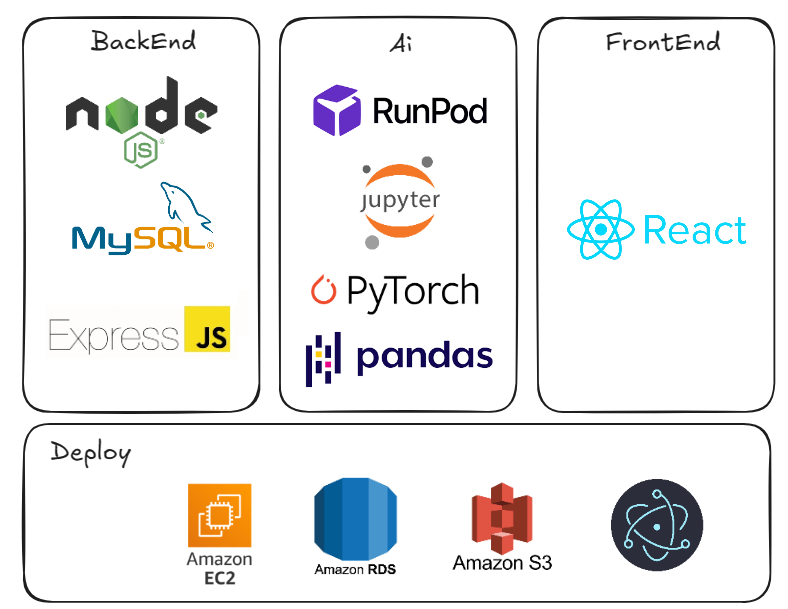
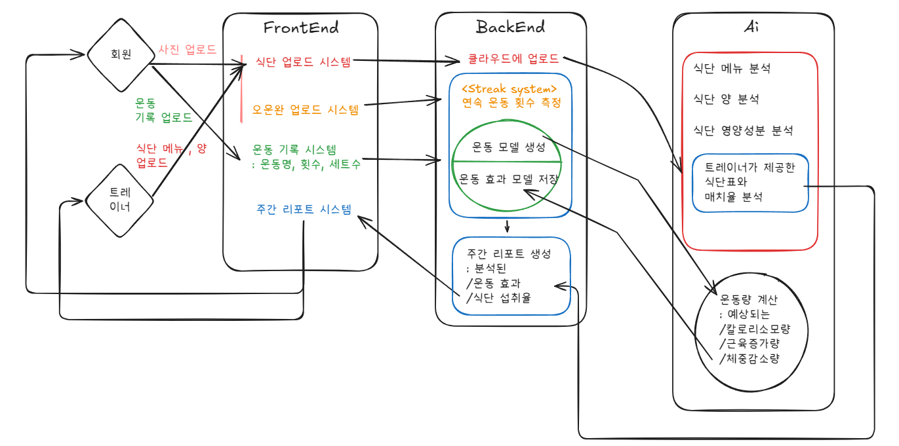

<!-- Template for PROJECT REPORT of CapstoneDesign 2025-2H, initially written by khyoo -->
<!-- 본 파일은 2025년도 컴공 졸업프로젝트의 <1차보고서> 작성을 위한 기본 양식입니다. -->
<!-- 아래에 "*"..."*" 표시는 italic체로 출력하기 위해서 사용한 것입니다. -->
<!-- "내용"에 해당하는 부분을 지우고, 여러분 과제의 내용을 작성해 주세요. -->

# Team-Info
| (1) 과제명 | *헬스 트레이너의 회원 관리를 돕는 YOLO 객체탐지, LLM 및 실시간 알림 시스템 기반 통합 관리 서비스*
|:---  |---  |
| (2) 팀 번호 / 팀 이름 | *01-파브르* |
| (3) 팀 구성원 | 한지인 (2276350): 리더, *데이터베이스 설계 및 관리, 백엔드 기능 API 개발, 배포*   장다연 (2176350): 팀원, *화면 디자인, 프론트엔드 개발 및 관리, 백엔드와 프론트엔드 연동*   박민서 (2276114) : 팀원, *AI 모델 설계 및 개발, 기술 검증, 배포*			 |
| (4) 팀 지도교수 | 심재형 교수님 |
| (5) 과제 분류 | *산학과제* |
| (6) 과제 키워드 | *YOLO Object Detection, Image Detection, LLM, 실시간 알림*  |
| (7) 과제 내용 요약 | *본 프로젝트는 트레이너가 여러 회원을 효율적으로 관리하기 어려운 기존의  PT 환경을 해결하기 위해 기획되었다. 퍼스널  YOLO 기반 객체 탐지와 LLM 기반 텍스트 요약, 푸시 알림 기능을 활용한 통합 관리 시스템을 통해 트레이너와 회원 간의 비효율적인 수업 일정 조율과 운동/식단 관리 문제를 해결하고자 한다. 회원은 운동 완료 사진과 식단 사진을 업로드하면 AI가 이를 자동 분석하여 주간 리포트를 생성하고, 트레이너는 이 리포트를 기반으로 맞춤형 피드백을 제공할 수 있다. 실시간 수업 신청 시스템과 자동 일정 리마인드 기능으로 스케줄 관리 또한 간편화된다. 해당 시스템은 트레이너의 업무 부담을 줄이고, 회원의 운동 지속성과 목표 달성률을 높이는 것을 목표로 한다.* |

 

# Project-Summary
| 항목 | 내용 |
|:---  |---  |
| (1) 문제 정의 | *퍼스널 트레이닝 수요가 증가함에 따라, 트레이너는 다양한 회원을 동시에 관리해야 하는 부담이 커지고 있다. 특히 트레이너는 수많은 회원의 운동 기록과 식단을 수기로 확인하고 피드백을 제공해야 하며, 매주 반복되는 수업 일정 조율에도 많은 시간을 소비하고 있다. 이러한 반복적이고 수동적인 관리 방식은 트레이너의 업무 효율을 떨어뜨리고, 체계적인 피드백 제공을 어렵게 만든다.*  - Target Customer: 1:1 퍼스널 트레이닝을 제공하는 트레이너 - Pain Points : 회원 개별 피드백에 많은 시간 소요 &nbsp;&nbsp;&nbsp;&nbsp;&nbsp;&nbsp;&nbsp;&nbsp;&nbsp;&nbsp;&nbsp;&nbsp;&nbsp;&nbsp;&nbsp;&nbsp;&nbsp;&nbsp;&nbsp;&nbsp;&nbsp;&nbsp;&nbsp;&nbsp;수업 시간 조율 및 리마인드 수동 처리 &nbsp;&nbsp;&nbsp;&nbsp;&nbsp;&nbsp;&nbsp;&nbsp;&nbsp;&nbsp;&nbsp;&nbsp;&nbsp;&nbsp;&nbsp;&nbsp;&nbsp;&nbsp;&nbsp;&nbsp;&nbsp;&nbsp;&nbsp;&nbsp;회원 식단 관리의 비효율성과 불확실성|
| (2) 기존연구와의 비교 | *1. Diet101(https://github.com/JangMinSeong/Diet101?utm_source=chatgpt.com) - 장점: 사용자들이 음식 사진을 통해 섭취한 영양소를 확인하고, 식단 히스토리 관리, 음식 사진 및 영양성분표 인식, 섭취 가능 음식 추천 등의 기능을 제공하여 보다 편리한 식단 관리를 돕는다.  - 단점: 이 서비스는 단순한 음식 추천에 그쳐, 체계적인 식단 관리에는 한계가 있다. 특히, 트레이너가 계획한 식단과 실제 사용자의 식단이 다를 수 있어, 트레이너 입장에서 회원의 체계적인 식단 관리가 어렵다. - 채찍피티의 차별점: 트레이너는 식단을 개별 확인할 필요없이 다수의 회원 식단을 일괄 관리할 수 있으며, AI가 자동으로 분석한 영양소 섭취 데이터를 바탕으로 더욱 효율적인 피드백을 제공할 수 있다. 회원은 사진 촬영만으로 식습관을 기록하고 트레이너에게 공유할 수 있으며, 식단 목표 달성률도 자동으로 계산된다.  2. 플랜핏(https://planfit.ai/ko) - 장점: AI가 운동을 추천해주고 사용자를 위한 맞춤 운동 루틴을 추천해준다. 비슷한 사람들의 데이터를 통한 루틴 추천이 가능하다  - 단점: 트레이너와의 연동 기능이 부족하고, 주간/월간 리포트 시각화 기능이 부족하다. 단순히 기계가 루틴을 짜기 때문에 트레이너와 같은 전문적인 인간의 개입이 어렵다.  - 채찍피티의 차별점: 트레이너가 회원 정보를 종합적으로 분석해 효율적인 피드백을 제공할 수 있는 AI 자동 리포트 시스템을 중심으로 구성되어 있다. 트레이너 중심의 운영 시스템을 제공하여 관리 효율성과 피드백 정확도가 월등히 높다* |
| (3) 제안 내용 | *채찍피티는 퍼스널 트레이너의 회원 관리 부담을 획기적으로 줄이기 위해 운동·식단 자동 분석, 수업 스케줄 최적화, 맞춤형 리포트 제공 기능을 통합한 시스템이다. 기존에는 트레이너가 회원의 데이터를 수동으로 확인하고 피드백을 제공해야 했으나, 본 프로젝트는 이를 자동화함으로써 관리 효율을 극대화한다.  1. 회원이 운동/식단 사진을 업로드하면 YOLO와 AI 모델이 자동 분석하여 주간 리포트를 생성한다.  2. 트레이너는 회원별 피드백 및 개인 운동 현황을 확인하고 맞춤 지도를 제공할 수 있다. 또한 트레이너는 수업 시간 운동을 기록하고, 회원은 개인 운동을 기록하여 현재 진행사항이 두 유저간 원활히 공유되도록 한다. 3. 어플 내 수업 등록 및 예약 기능을 통해 스케줄 조율을 간소화하고, 푸시 알림을 통해 리마인드를 제공함 4. 트레이너 중심의 대시보드로 회원 목록, 운동 기록, 식단, 스케줄을 통합 관리할 수 있고 회원은 자신의 페이지에서 확인할 수 있다.  이러한 기능은 트레이너의 수동 관리 부담을 줄이고, 회원에게는 더 체계적이고 지속적인 피드백을 제공함으로써 양측 모두에게 실질적인 편의와 효과를 제공한다.* |
| (4) 기대효과 및 의의 | *- 트레이너는 모든 회원과 스케줄링을 위해 메신저 앱으로 연락하지 않아도 되고, 모든 회원의 운동 및 식단 기록을 통합적으로 관리할 수 있어 시간과 업무 효율이 향상된다. - 회원은 자신의 운동 기록을 트레이너가 일일이 확인해주지 않아도 AI 리포트를 통해 피드백을 받을 수 있다. -자동화된 주간 리포트 및 달성률 체크& 실시간 알림을 통해 운동 지속성 및 식단 달성률이 높아지고, 트레이너의 관리 시스템이 상향 평준화되어 건강 관리의 질이 향상된다. -기존 수동 방식의 PT 관리 시스템에 비해 자동 식단 달성률 및 AI 운동 플랜 피드백으로 기술적 우위를 갖춘 차세대 솔루션으로 확장 가능성이 높다. -회원 개인의 데이터를 기반으로 한 AI 분석과 트레이너 피드백의 융합으로 트레이닝의 객관성과 전문성이 강화된다* |
| (5) 주요 기능 리스트 | *1. 트레이너/회원 역할 구분 및 관리 기능 - 회원가입 시 역할 구분 (trainer, member) - 트레이너가 회원 목록 조회, 등록, 삭제, 스케줄 등록 가능 - 회원은 트레이너 스케줄 확인 및 수업 신청 가능  2. 운동 기록 자동 분석 및 리포트화 - PT 세션 내에 진행한 운동에 대한 정보는 트레이너가 입력하고, 짜여진 플랜에 맞게 회원이 개인 운동을 기록 - 부위별 운동 정보, 횟수, 세트 수 요약 및 저장 - 트레이너는 주간 운동 데이터 기반으로 자동 생성된 리포트를 확인 가능 - 회원의 운동 내용(부위 및 강도, 특이사항)을 바탕으로 진척도가 리포트에 표시되고, 트레이너는 회원의 달성률을 확인할 수 있음  - OpenAi Api가 운동 예상 효과 및 자동 피드백을 주어 트레이너의 업무 강도를 낮춤  3. AI 기반 식단 분석 및 피드백 제공 - 회원이 업로드한 식단 이미지 분석 - 음식 메뉴 추출률 파인 튜닝 및 Food101 기반 모델과 볼륨 추정 API를 통해 칼로리, 영양소 분석 - 트레이너가 설정한 식단과 비교해 일치율, 달성률 계산 - 결과는 주간 식단 리포트에 반영되어 피드백 제공 가능  4. 스케줄 매칭 및 알림 시스템 - 트레이너는 어플 내에서 주 단위 스케줄 등록 가능 - 회원은 스케줄 목록을 보고 신청, 수업 자동 매칭 - 스케줄 변경 및 취소시 트레이너와 회원 모두에게 반영됨  5. 대시보드 기반 통합 관리 시스템 - 트레이너가 회원 운동 기록, 식단 기록, 예약 현황을 통합 조회 가능 - 모든 정보는 REST API로 연결되어 실시간으로 갱신됨*|

 
 
# Project-Design & Implementation
| 항목 | 내용 |
|:---  |---  |
| (1) 요구사항 정의 | *- 유즈케이스 기반 요구사항 명세 ① 회원은 트레이너 스케줄을 조회하고 수업 신청을 할 수 있어야 한다. ② 트레이너는 회원을 등록/삭제하고, 각 회원의 운동 및 식단 데이터를 확인할 수 있어야 한다. ③ 회원은 운동 완료(오운완) 사진 및 식단 사진을 업로드하면 자동으로 주간 리포트가 생성되어야 한다. ④ 트레이너와 회원은 실시간으로 푸시 알림을 받을 수 있어야 한다. ⑤트레이너는 각 회원의 운동 진행률과 특이사항을 확인할 수 있어야 한다.  - ERD: https://www.erdcloud.com/d/MREqvJw3CWW526nSA  사용자(트레이너/회원), 운동 기록, 식단 기록, 스케줄, 피드백 정보를 관계형 DB 기반으로 정리*|

| 카테고리 | 기능명 |
|---|--------|
| 식단/운동/프로필 업로드 | 식단 사진 업로드 |
|  | 오운완 사진 업로드 |
|  | 프로필 사진 업로드 |
| 업로드된 사진 조회 | 업로드된 식단 사진 리스트 조회 |
|  | 업로드된 오운완 사진 리스트 조회 |
|  | 업로드된 프로필 사진 리스트 조회 |
| 식단 분석 기능 | AI 식단 분석 |
| 스케줄 | 스케줄 등록/조회/신청/삭제 |
| 리포트 | 주간 리포트 생성 |
|  | 주간 리포트 조회 |
|  | 주간 정보 입력 (월간 그래프용) |
|  | 월간 시각화 |
| 회원 기능 | 회원 프로필 조회 |
|  | 회원가입 |
|  | 로그인/로그아웃 |
|  | 운동 기록 |
| 실시간 알림 | 운동 갈 시간 → 회원 실시간 알림 |
|  | 오운완 X → 트레이너 실시간 알림 |
|  | 오운완 실시간 업로드 |
| 기타 기능 | S3 업로드 설정 |
|  | 배포 관련 설정 |
|  | 상품 추천 크롤링 |
|  | 운동 스트릭 시스템 (듀오링고 유사) 
| (2) 전체 시스템 구성 | *전체 시스템은 Frontend, Backend, AI 모듈로 구성되어 있다.  1. Frontend: React.js 기반 웹 애플리케이션, Electron으로 데스크탑 앱 확장  2. Backend: Node.js, Express 기반 REST API 서버, MySQL DB 연동  3. AI: YOLOv8, PyTorch, pandas, Food101 기반 식단 분석, OpenAI API 활용 리포트 요약 생성  4. Deploy: AWS EC2, RDS, S3 활용 클라우드 배포 및 스토리지 구성 * |
| (3) 주요엔진 및 기능 설계 | *1. FrontEnd 모듈 - 식단 업로드 시스템: 회원이 식단 사진을 업로드하면 해당 이미지를 클라이언트에서 S3 서버로 전송 - 오운완 업로드 시스템: 운동 완료 사진 업로드 시 Backend로 전송 → YOLO를 통해 부위/운동 분석 - 운동 기록 시스템: 운동명, 횟수, 세트 수를 입력 및 전송 - 주간 리포트 시스템: Backend에서 생성된 리포트를 회원과 트레이너가 열람 가능  Backend 모듈 - 클라우드 업로드: 프론트에서 전송된 이미지 데이터를 S3 서버에 업로드 - Streak System: 회원의 운동 지속 여부를 분석하여 연속 운동 횟수 계산 - 운동 모델 생성: 회원의 입력 또는 AI 분석 결과를 통해 운동 모델을 생성하고 DB에 저장 - 주간 리포트 생성 시스템: AI 분석 결과와 DB의 데이터를 종합하여 주간 리포트를 자동 생성 (운동 효과, 식단 섭취율 포함) *

 AI 모듈 - 식단 분석 기능: 업로드된 식단 사진에서 메뉴 추출 (YOLO + ~Food101~*건강관리를 위한 음식 이미지*) - 각 메뉴별 ~양(볼륨)~ *종류* 분석 → ~g 단위 추정 (볼륨 추정 API)~ - 영양성분 자동 산출 (칼로리, 단백질, 탄수화물 등) - 트레이너가 설정한 식단과 회원 식단의 일치율 분석 - *운동 분석 기능:운동 모델에서 운동 동작 및 신체 부위 분석, 운동 부위별 빈도, 횟수, 세트 수 불러오기*~운동 분석 기능:오운완 사진에서 운동 동작 및 신체 부위 분석, 운동 부위별 빈도, 횟수, 세트 수를 자동 계산~ - 운동량 효과 계산: 예상 칼로리 소모량, 근육 증가량, 체중 감소량 등을 계산, 결과 데이터를 Backend에 전송하여 리포트에 반영 |
| (4) 주요 기능의 구현 | 1. AI 식단 분석 기능 - 회원이 제출한 음식 사진에서 YOLO 및 Food101 기반 객체 탐지를 활용하여 음식 메뉴를 인식하고, 불필요한 사물 인식을 방지하기 위해 모델 파인튜닝을 진행함 - ~인식된 음식에 대해 볼륨 추정 API를 활용하여 g 단위의 섭취량을 계산하고,~*탐지된 음식 메뉴*를 기반으로 칼로리 및 주요 영양소(kcal, g 단백질 등)를 *베이스 DB에서 가져와서* 자동 산출함 - 트레이너가 사전에 설정한 식단과 실제 업로드된 식단을 비교하여 일치율을 계산하며, 일치율은 주간 리포트에 반영됨 - 주간 식단 리포트에는 식단 달성률, 평균 영양소 섭취량(g 단위)이 시각화되어 제공되며, 트레이너는 이를 기반으로 회원의 식습관을 한눈에 파악 가능함 
 2. 운동 기록 및 주간 리포트 생성 - 회원은 실시간으로 운동 완료 사진(오운완)을 업로드하고, 텍스트로 직접 운동 수행 내역(부위, 횟수, 세트 수 등)을 기록함 - ~YOLO 기반 모델이 사진 내 운동 동작을 인식하고 운동 종류 및 수행 횟수 등을 자동 추출함~*입력된 운동 정보를 기반으로 그날의 운동 기록 모델이 생성됨* - 입력된 운동 기록은 MySQL DB에 저장되며, 주간 단위로 통계가 집계됨 - *OpenAI API를 통해 GPT4o 모델을 불러서, *상체/하체/유산소 등 부위별 운동 수행률이 자동 계산되고, OpenAI API를 활용해 * 예상 소모 칼로리량, 근성장량, 체중 변화량* ~운동 편중 여부, 개선 필요 부위, 목표 달성률~ *운동을 잘 수행했는지 한 줄* 피드백 문장을 생성함,  *예시 : "total_calories_burned":"-420",
"muscle_change":"+1",
"body_change":"-0.5",
"feedback":"운동을 꾸준히 하셨습니다.",* - 해당 리포트는 트레이너 및 회원에게 자동 전달되며 운동 예상 효과가 시각화됨 |
| (5) 기타 | *배포 시 수익 창출을 고려하여 식단 추천 시 상품 추천 크롤링으로 구매 링크를 추가하거나, 운동 스트릭을 유저가 쉽게 확인할 수 있도록 위젯에 추가할 수 있는 기능도 고려 중*  |

 
